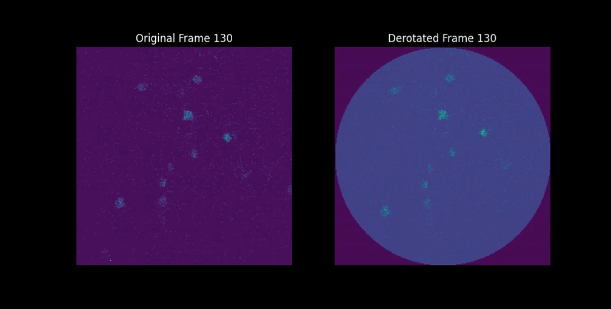

(target-derotation)=
# Derotation
A Python package for reconstructing movies of rotating samples acquired with a line scanning microscope.

::::{grid} 1 2 2
:gutter: 2

:::{grid-item-card} 📘 User guide
:link: user_guide/index
:link-type: doc

Installation, configuration, supported formats, and key concepts.
:::

:::{grid-item-card} 🧪 Examples
:link: examples/index
:link-type: doc

A gallery of real and synthetic examples using `derotation`.
:::

::::

## Overview
To address certain neuroscience questions in rodents, it might be necessary to image the brain while the head or the body of the animal rotates. In such a case, and even more when the frame rate is low, the acquired movies are distorted by the rotation. These distortions have a peculiar pattern due to the line scanning nature of the microscope, which can be corrected by the derotation package.



With `derotation` you can:
- Recover calcium imaging movies by **line-by-line derotation** that can be fed into standard analysis pipelines such as suite2p;
- Estimate the **center of rotation** using Bayesian optimization;
- Validate improvements to the derotation algorithm and pipelines using synthetic data;
- Use debugging plots and logs to verify the quality of the derotation;
- Batch-process multiple datasets with consistent configuration files.

The package is currently in early development and it requires rotation information coming from a step motor.


## References
```{include} ../../README.md
:start-after: '## References'
```

```{toctree}
:maxdepth: 2
:hidden:

user_guide/index
examples/index
api_index
```
