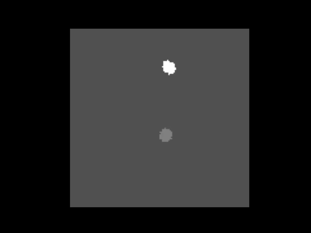

(user_guide/key_concepts)=
# Key Concepts

`derotation` is a modular package for reconstructing rotating image stacks acquired via line scanning microscopes. This page covers the core ideas, flow of information, and how the main modules interact.
See the [API documentation](api_index) for full reference.

## How derotation works

Without derotation, movies acquired with a line scanning microscope are geometrically distorted — each line is captured at a slightly different angle, making it hard to register or interpret the resulting images.

If the angle of rotation is recorded, `derotation` can reconstruct each frame by assigning a rotation angle to each acquired line and rotating it back to its original position. This is what is called derotation-by-line. This process incrementally reconstructs each frame and can optionally include shear deformation correction.

## How to use derotation

There are two main ways to use `derotation`:

### 1. **Low-level core function**
Use `derotate_an_image_array_line_by_line` to derotate an image stack, given:
- The original calcium imaging movie (expects only one imaging plane)
- Rotation angle per line

This is ideal for testing and debugging with synthetic or preprocessed data.

### 2. **Full or incremental pipeline classes**
Use the pre-made pipelines to run end-to-end processing:

- `FullPipeline`: assumes randomised complete clockwise and counter-clockwise rotations. It includes:
  - Analog signal parsing
  - Angle interpolation
  - Bayesian optimization for center estimation
  - Derotation by line (calling `derotate_an_image_array_line_by_line`)

- `IncrementalPipeline`: assumes a continuous rotation performed in small increments. It inherits functionality from the `FullPipeline` but does not perform Bayesian optimization. It can be useful as an alternative way to estimate center of rotation.

Both pipelines accept a configuration dictionary (see the [configuration guide](configuration)) and output:
- Derotated TIFF
- CSV with rotation angles and metadata
- Debugging plots
- A text file with optimal center of rotation
- Logs

You can subclass `FullPipeline` to create custom pipelines by overwriting relevant methods.

---

## Finding the center of rotation

An accurate center of rotation is crucial for high-quality derotation. Even small errors can produce residual motion in the derotated movie — often visible as circles traced by stationary objects as cells.

In this picture, you can see in red the centers of one of the cells in the movie across different angles. Since the center is not correctly estimated, the cell appears to move in a circle.

Derotation offers two approaches for estimating the center:

### Bayesian optimization via FullPipeline

This method searches for the correct center of rotation by derotating the whole movie and minimizing a custom metric, computed through the function `ptd_of_most_detected_blob`. It requires the average image of the derotated movie at different rotations angles, and from them detects blobs, searches for the most frequent and calculates the Point-to-Point Distance (PTD) for it across blob centers at different rotation angles.

It is robust but computationally expensive.

### Ellipse fitting via IncrementalPipeline

This method exploits the fact that incremental datasets rotate very slowly and smoothly. It works by:

- Detecting largest blob in the first frame
- Tracking its position across rotations
- Fitting an ellipse to the trajectory

The center of the ellipse is assumed to match the true center of rotation. This method fails when the cell stops being visible in certain rotation angles.

Once the center is estimated, it can be fed to the FullPipeline to derotate the whole movie.

---

## Verifying derotation quality

Use debugging plots and logs to assess the quality of your reconstruction. These include:
- Analog signal overlays
- Angle interpolation traces
- Center estimation visualizations
- Derotated frame samples

You can also inject **custom plotting hooks** at defined pipeline stages. See the examples page for a demonstration. *Note: hooks may significantly slow down processing.*

---

## Simulated data

Use the `Rotator` and `SyntheticData` classes to generate test data:

- `Rotator`: applies line-by-line rotation to an image stack, simulating a rotating microscope. It can be used to generate challenging synthetic data that include wrong centers of rotation and out of imaging plane rotations.
- `SyntheticData`: creates fake cell images, assigns rotation angles, and generates synthetic stacks. This is especially useful for validating both the incremental and full pipelines under known conditions.

This is an example of a synthetic dataset with two cells generated with the `Rotator` class.

---

## Limitations

Derotation supports two experimental configurations: randomized full rotations (in the `FullRotation` pipeline) and small-step incremental rotations (`IncrementalPipeline`). Other rotation paradigms are not currently supported out of the box.

The package assumes strict input formats — TIFF stacks for images and `.bin` files with analog signals following a specific channel order. Both pipelines require:
- timing of rotation ticks, which are used to compute rotation angles;
- line clock signals, which indicate the start of a new line;s
- frame clock signals, which indicate the start of a new frame;
- a rotation on signal, which indicates when the rotation is happening.

If your data is stored in different formats or structured differently, you can write a **custom data loader** that loads rotation angles and line/frame timing, then passes them directly to the core derotation function or integrates into a custom pipeline subclass.

If you don't have a step motor but a continuous array of rotation angles, you have to clean the signal and interpolate it to match the line clock signal. You would have to write a custom data loader to handle this and a pipeline subclass to process the data.
