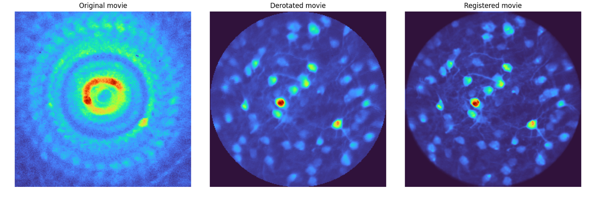

# Summary

In neuroscience research line scanning microscopes are frequently used in the context of multi-photon calcium imaging. Scientist frequently use them for in vivo recordings of the brain, and the animal might be head fixed. People might want to study the integration of different sensory systems, and for the vestibular the recording might need to be paired with complex behavioural setups that can rotate the animal in order to generate a relevant stimuli.
When multiphoton calcium imaging is performed during rotational movements of the sample, such as in head-fixed mice rotating their heads, the resulting images are geometrically distorted. These distortions arise because the image is acquired line-by-line, and even small angular changes during a frame scan cause features to appear skewed or curved. Without correction, these artifacts can hinder downstream analyses such as motion registration, cell detection, and fluorescence signal extraction. Even though there have been already several studies addressing this issue [1-4], a general-purpose solution is still lacking.

**derotation** is an open-source Python package that reconstructs undistorted imaging movies from data acquired under sample rotation. By using recorded rotation angles for each scan line, the software applies a line-by-line transformation to restore the original geometry of the imaged plane. This makes it possible to perform reliable calcium imaging during rapid head rotations, enabling researchers to study vestibular–sensory integration without sacrificing image quality.

# Statement of Need

Head rotations are essential for navigation, expanding the range of sensory information an animal can sample. The vestibular system encodes these movements and integrates them with sensory signals in cortical and subcortical networks [@Angelaki2011; @VelezFort2018; @SitGoard2023]. Calcium imaging during head rotation is increasingly used to probe these processes in behaving animals, for example in experiments where head-fixed mice either rotate passively on a motorized platform or actively turn against a torque [@VelezFort2018; @Hennestad2021].

However, under standard raster-scanning multiphoton microscopy, rotational motion produces characteristic “fan-like” image distortions. These artifacts depend on both the rotation speed and the frame rate, and at high angular velocities can render images difficult to interpret. While individual groups have implemented custom scripts to address this problem, there has been no general-purpose, open-source Python tool to correct rotation-induced distortions.

**derotation** addresses this gap by providing a documented, tested, and modular solution for post hoc correction of imaging data acquired during head rotation. It allows researchers to retain their existing acquisition setups and still obtain images suitable for quantitative analysis, even in experiments involving high-speed rotation. This capability is particularly valuable in three-photon imaging, where low frame rates make the distortions more pronounced.

# Functionality

The package operates by first parsing microscope and motor control signals to determine the rotation angle for each scan line of the movie. It can ingest raw analog information from the microscope (line and frame clock) and from the step motor (rotation ticks). Alternatively, it can accept also an array of cumulative angle rotations for each line. It then applies an inverse rotation transform around a specified or estimated center of rotation, realigning each line to its correct spatial position. The corrected lines are reassembled into frames, producing a movie that appears as if the sample had remained stationary.

It is possible to access the derotation core transform from the derotate_an_image_array_line_by_line method, available in isolation from the complete pipelines. It is however suggested to use the pipelines when possible as they cover many edge cases and pitfals and create logs and debugging plots to ensure the quality of the derotation process.

Two processing workflows are provided. The *FullPipeline* is intended for alternating back-and-forth rotations. This is the main pipeline as it is expected that an experimental protocol will include a randomization of the stimuli. It includes automated center-of-rotation estimation using Bayesian optimization. This procedure tests different centers and selects the one that minimises residual motion in the corrected images. The *IncrementalPipeline* is designed for continuous, single-direction rotations and assumes that the center is known in advance, enabling faster processing. Both pipelines can be configured using YAML or Python dictionaries, making it straightforward to apply the same parameters to multiple datasets. Each run produces a corrected TIFF stack, logs of the rotation angles used, diagnostic plots, and quality-control metrics to help assess the success of the correction.

Validation has been performed using synthetic datasets, where the ground truth geometry is known, as well as real three-photon recordings from head-rotated mice. In both cases, the corrected images showed restored cell morphology and were successfully processed by downstream analysis pipelines such as Suite2p [@Pachitariu2017] without residual rotation artifacts. The implementation relies on standard Python scientific libraries, including NumPy and SciPy, and is distributed under a BSD-3-Clause license. Documentation, tutorials, and example datasets are available at <https://derotation.neuroinformatics.dev>. Via Binder, it is possible to run the software in a cloud-based environment without local installation using sample data hosted on Gin.

For further feature development, further synthetic data can be generated using the Rotator class, which simulates line acquisition from a line scanning microscope. In this way edge cases of sampling (different inclinations, mismatched center of rotation, different frame rates) can be tested.

# Acknowledgements

We thank Simon Weiler for providing three-photon imaging datasets used during development and testing, and the Neuroinformatics Unit at the Sainsbury Wellcome Centre for infrastructure and support.

## References
Previous work on derotation of calcium imaging movies:
- 1. [Velez-Fort et al., 2018, Neuron](https://doi.org/10.1016/j.neuron.2018.02.023)
- 2. [Hennestad et al., 2021, Cell Reports](https://doi.org/10.1016/j.celrep.2021.110134)
- 3. [Sit & Goard, 2023, Nature Communications](https://doi.org/10.1038/s41467-023-37704-5)
- 4. [Voigts & Harnett, 2020, Neuron](https://doi.org/10.1016/j.neuron.2019.10.016)

This package was inspired by [previous MATLAB script on derotation](https://github.com/jvoigts/rotating-2p-image-correction).
