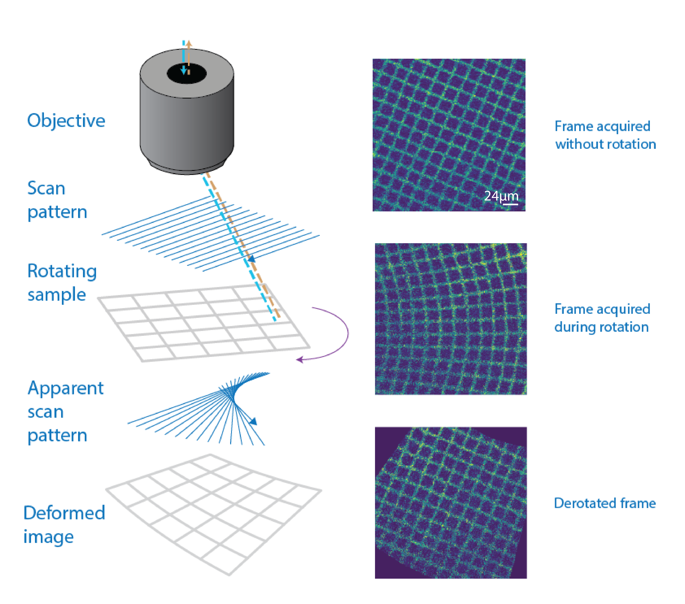

# Summary

Line-scanning microscopy, including multi-photon calcium imaging, is a powerful technique for observing dynamic processes at cellular resolution. However, when the imaged sample rotates during acquisition, the sequential line-by-line scanning process introduces geometric distortions. These artifacts, which manifest as shearing or curving of features, can severely compromise downstream analyses such as motion registration, cell detection, and signal extraction. While several studies have developed custom solutions for this issue [1-4], a general-purpose, accessible software package has been lacking.

derotation is an open-source Python package that algorithmically reconstructs movies from data acquired during sample rotation. By leveraging recorded rotation angles and the microscope's line acquisition clock, the software applies a precise, line-by-line inverse transformation to restore the original geometry of the imaged plane. This correction enables reliable quantitative imaging during rapid rotational movements, making it possible to study yaw motion without sacrificing image quality.

# Statement of Need

Any imaging modality that acquires data sequentially, such as multi-photon microscopy, is susceptible to motion artifacts if the sample moves during the acquisition of a single frame. When this motion is rotational, it produces characteristic "fan-like" distortions that corrupt the morphological features of the imaged structures. This significantly complicates, or even prevents, critical downstream processing steps like cell segmentation and automated region-of-interest tracking.

This problem is particularly acute in systems neuroscience, where researchers increasingly combine two-photon or three-photon calcium imaging with behavioral paradigms involving head rotation to study sensory integration and navigation [1-4]. In such experiments, where head-fixed animals may be passively rotated or actively turn, high-speed angular motion can render imaging data unusable without correction. The issue is even more acute in imaging modalities with lower frame rates, such as three-photon calcium imaging. While individual labs have implemented custom scripts to address this, there has been no validated, open-source, and easy-to-use Python tool available to the broader community.

derotation directly fills this gap by providing a documented, tested, and modular solution for post hoc correction of imaging data acquired during rotation. It empowers researchers to perform quantitative imaging during high-speed rotational movements. By providing a robust and accessible tool, derotation lowers the barrier for entry into complex behavioral experiments and improves the reproducibility of a key analysis step in a growing field of research.

# Functionality
The core of the derotation package is a line-by-line affine transformation. It operates by first establishing a precise mapping between each scanned line in the movie and the rotation angle of the sample at that exact moment in time. It then applies an inverse rotation transform to each line around a specified or estimated center of rotation. Finally, the corrected lines are reassembled into frames, producing a movie that appears as if the sample had remained stationary.

## Data Ingestion and Synchronization
The package accepts two types of input formats depending on the processing approach:

**For pipeline workflows (FullPipeline and IncrementalPipeline):**
These pipelines are designed for experimental setups with synchronized rotation and imaging data. The required inputs are:
- An array of analog signals containing timing and rotation information, typically including:
  1. **Line clock** – signals the start of a new line (from acquisition software)
  2. **Frame clock** – signals the start of a new frame (from acquisition software) 
  3. **Rotation ON signal** – indicates when the rotation system is active
  4. **Rotation position feedback** – used to compute rotation angles (from a step motor)
- A **CSV file** describing speeds and directions.

**For low-level core function:**
Advanced users can bypass the pipeline workflows and use the core transformation function directly by providing:
- The original multi-photon movie (expects only one imaging plane)
- A pre-computed rotation angle array for each line

This modular design allows users with custom experimental setups to integrate the derotation algorithm into their own analysis scripts while still benefiting from the core transformation logic.

## Processing Pipelines
For ease of use, derotation provides two high-level processing workflows tailored to common experimental paradigms. These pipelines handle data loading, parameter validation, processing, and saving outputs, while also generating logs and debugging plots to ensure quality control.

- **FullPipeline** is engineered for experimental paradigms involving randomized, clockwise or counter-clockwise rotations. It assumes that there will be complete 360° rotations of the sample. As part of its workflow, it can optionally estimate the center of rotation automatically using Bayesian optimization, which minimizes residual motion in the corrected movie.

- **IncrementalPipeline** is optimized for stepwise, single-direction rotations. This rotation paradigm is useful for calibration of the luminance across rotation angles. It can also provide an alternative estimate of the center of rotation, fitting the trajectory of a cell across rotation angles.

Both pipelines are configurable via YAML files or Python dictionaries, promoting reproducible analysis by making it straightforward to document and re-apply the same parameters across multiple datasets.

Upon completion, a pipeline run generates a comprehensive set of outputs:

- The primary corrected movie, saved as a TIFF stack
- A CSV file with rotation angles and metadata for each frame
- Debugging plots including analog signal overlays, angle interpolation traces, and center estimation visualizations
- A text file containing the estimated optimal center of rotation
- Log files with detailed processing information

The debugging plots are particularly valuable for quality control, helping users assess the success of signal processing and derotation correction. These plots are saved by default in a `debug_plots` folder and include visualizations of analog signal processing, angle interpolation, center estimation, and sample derotated frames.

## Validation and Extensibility
The package's effectiveness has been validated on both synthetic datasets, where the ground-truth geometry is known, and on real three-photon recordings from head-fixed mice. In both cases, the corrected images showed restored cellular morphology and were successfully processed by standard downstream analysis pipelines such as Suite2p [5].

The sythetic data can be generated using the following classes:
- **Rotator class**: Applies line-by-line rotation to an image stack, simulating a rotating microscope. It can generate challenging synthetic data including misaligned centers of rotation and out-of-plane rotations.
- **SyntheticData class**: Creates fake cell images, assigns rotation angles, and generates synthetic stacks leveraging the Rotator class. It is a complete synthetic dataset generator.

The implementation relies on standard Python scientific libraries, including NumPy, SciPy, and Scikit-optimize, and is distributed under a BSD-3-Clause license. Comprehensive documentation, tutorials, and example datasets are available at https://derotation.neuroinformatics.dev. Using Binder, users can run the software in a cloud-based environment with sample data without requiring any local installation.

# Acknowledgements

We thank Simon Weiler for providing three-photon imaging datasets used during development and testing, and the Neuroinformatics Unit at the Sainsbury Wellcome Centre for infrastructure and support.

## References
Previous work on derotation of calcium imaging movies:
- 1. [Velez-Fort et al., 2018, Neuron](https://doi.org/10.1016/j.neuron.2018.02.023)
- 2. [Hennestad et al., 2021, Cell Reports](https://doi.org/10.1016/j.celrep.2021.110134)
- 3. [Sit & Goard, 2023, Nature Communications](https://doi.org/10.1038/s41467-023-37704-5)
- 4. [Voigts & Harnett, 2020, Neuron](https://doi.org/10.1016/j.neuron.2019.10.016)
- 5. [Pachitariu et al., 2016, BioRxiv](https://doi.org/10.1016/j.neuron.2017.07.007)

This package was inspired by [previous MATLAB script on derotation](https://github.com/jvoigts/rotating-2p-image-correction).
